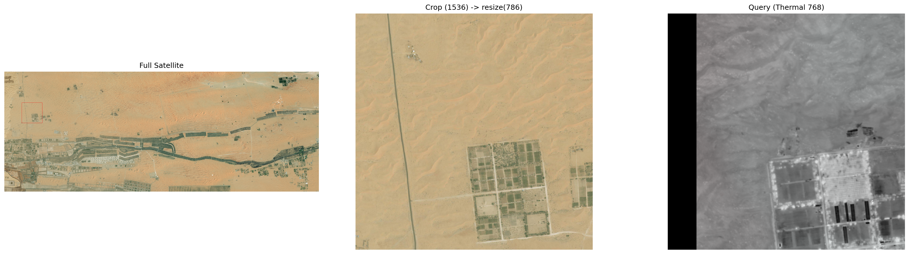

# Drone Dataset Processing Pipeline

A complete pipeline for processing drone thermal imagery and satellite images to generate, validate, and visualize geospatial datasets.

---

## Part 1: Dataset Generation (Dataset_making)

Raw Images → Coordinate Extraction → Crop → HDF5 Conversion

| Step | File | Input | Output |
|------|------|-------|--------|
| 1 | `1_make_csv.py` | PNG images | coordinates.csv |
| 2 | `2_image_crop.py` | 2048×1536 images | cropped/ (1536×1536) |
| 3 | `3_change_image_name.py` | cropped/ | Sequential file renaming |
| 4 | `4_refinement_china.py` | CSV | Pixel coordinate conversion |
| 5 | `5_preprocess.py` | Images + coordinates | HDF5 files |
| 6 | `6_make_x_y_swap.py` | HDF5 | Coordinate order correction |

**Run:**
```bash
python 1_make_csv.py && python 2_image_crop.py && python 3_change_image_name.py
python 4_refinement_china.py && python 5_preprocess.py && python 6_make_x_y_swap.py
```

**Input filename format:** `@timestamp@longitude@latitude@.png`

**Output:** `test_queries.h5`, `test_database.h5`

---

## Part 2: Dataset Validation (Datasets_checking)

Validates the structure, coordinates, and alignment of generated HDF5 files.

| File | Description | Command |
|------|-------------|---------|
| `check_1_q_db_info.py` | Check H5 file structure | `python check_1_q_db_info.py` |
| `check_1_custom_data.py` | Extract coordinate info | `python check_1_custom_data.py` |
| `check_2_sequence_plot.py` | Plot flight path | `python check_2_sequence_plot.py` |
| `check_2_sequence_satellite.py` | Overlay path on satellite image | `python check_2_sequence_satellite.py` |
| `check_3_database_crop_random_test.py` | Compare 5 random samples | `python check_3_database_crop_random_test.py` |
| `check_4_satellite_info.py` | Satellite image info | `python check_4_satellite_info.py` |
| `check_5_target_grid_crop.py` | Crop specific coordinates | Modify script before running |
| `query_satellite_check_center.py` | Visualize all pairs | `python query_satellite_check_center.py` |

**Quick Validation:**
```bash
python check_1_q_db_info.py
python check_1_custom_data.py
python check_2_sequence_satellite.py
python query_satellite_check_center.py
```

**Coordinate format:** `@row@col` (row: vertical, col: horizontal)

---

## Part 3: Image and Video Generation (Dataset_image_video_making)

Converts HDF5 files to images and generates videos.

| Step | File | Process | Output |
|------|------|---------|--------|
| 1 | `make_1_query_image.py` | 768×768 → 512×512 crop, save PNG | query/*.png |
| 2 | `make_2_query_vidio.py` | PNG → MP4 video (5fps) | query_video/uav_flight.mp4 |
| 3 | `make_3_total_jeju_0_125_copy.py` | Satellite-query pair visualization | total_images/pair_*.png |
| 3 | `make_3_total_NewYork.py` | Satellite-query pair visualization | total_images/pair_*.png |
| 4 | `make_4_toal_video.py` | Visualization → MP4 video | match_video/match.mp4 |

**Run:**
```bash
python make_1_query_image.py
python make_2_query_vidio.py
python make_3_total_jeju_0_125_copy.py  # or make_3_total_NewYork.py
python make_4_toal_video.py
```

**Validation:** Verify center point (red dot) alignment

---

## Part 4: Target Row Dataset Generation (Datasets_make_for_target_row)

### Overview

**Operates independently.** Can be used alongside Parts 1-3 or separately.

This pipeline extracts specific flight paths (rows) from generated HDF5 files and processes them as individual datasets.

**Use Cases:**
- Extract flight data for specific regions
- Focus analysis on specific paths during model training
- Generate small-scale test datasets

### Processing Steps

| Step | File | Description | Command |
|------|------|-------------|---------|
| 0 | `make_check_row.py` | Check available row list | `python make_check_row.py` |
| 1 | `make_row_1_query.py` | Extract queries, remove duplicates | `python make_row_1_query.py 3131` |
| 2 | `make_row_2_database.py` | Extract database | `python make_row_2_database.py 3131` |
| 2.5 | `make_row_2.5_refine.py` | Refine coordinate alignment (optional) | `python make_row_2.5_refine.py 3131` |
| 3 | `make_row_3_query_image.py` | Export PNG | `python make_row_3_query_image.py 3131` |
| 4 | `make_row_4_query_vidio.py` | Generate video | `python make_row_4_query_vidio.py 3131` |
| 6 | `make_row_6_satellite_trajectory.py` | Visualize trajectory | `python make_row_6_satellite_trajectory.py 3131` |

---

### Part 2 Results

**center-check**

pair_0002.png

**satellite-trajectory**

satellite_trajectory.png

### Part 4 Results

**total-image**

0001.png

**satellite-trajectory-check**

2276_trajectory.png

---

### How to Run

**Step 0: Check Available Rows**
```bash
python make_check_row.py
```

**Sequential Execution (select specific row, e.g., 3131)**
```bash
python make_row_1_query.py 3131
python make_row_2_database.py 3131
python make_row_2.5_refine.py 3131      # Optional
python make_row_3_query_image.py 3131
python make_row_4_query_vidio.py 3131
python make_row_6_satellite_trajectory.py 3131
```

**Automatic Execution (Recommended)**
```bash
# Modify target_number at the top of make_row_7_run_all.py
target_number = 3131

python make_row_7_run_all.py
```

### Output Structure

```
t_datasets/
├── 3131_datasets/
│   ├── test_queries.h5       # Extracted queries
│   └── test_database.h5      # Extracted database
├── 3131_query_images/
│   ├── q1_@3131@1000.png
│   ├── q2_@3131@1020.png
│   └── ...
├── video/
│   └── uav_flight_row3131.mp4
└── satellite_trajectory/
    └── 3131_trajectory.png
```

### Usage Examples

**Extract row 2276 from Jeju dataset**
```bash
python make_check_row.py
python make_row_1_query.py 2276
python make_row_2_database.py 2276
python make_row_3_query_image.py 2276
python make_row_4_query_vidio.py 2276
python make_row_6_satellite_trajectory.py 2276
```

**Quick processing with automatic mode**
```bash
# After modifying make_row_7_run_all.py
python make_row_7_run_all.py
```

---

## Complete Pipeline Flow

```
Raw Images
    ↓
[Part 1] Dataset Generation
    ├─ Coordinate extraction
    ├─ Image cropping
    └─ HDF5 conversion
    ↓
[Part 2] Dataset Validation
    ├─ Structure verification
    ├─ Coordinate validation
    └─ Visual inspection
    ↓
[Part 3] Image and Video Generation
    ├─ PNG export
    ├─ Pair visualization
    └─ Video generation
    ↓
Final Dataset Complete

[Part 4] Target Row Extraction (Optional & Independent)
    ├─ Row selection
    ├─ Linear path extraction
    └─ Individual processing
```

---

## Installation and Setup

### Required Libraries
```bash
pip install h5py opencv-python matplotlib numpy pandas natsort pillow
```

### Path Configuration
Modify at the top of each script:
- `input_dir`: Raw image folder
- `output_dir`: Output folder
- `query_h5_path`: Query H5 path
- `db_h5_path`: Database H5 path
- `sat_img_path`: Satellite image path

---

## Key Features

- Automatic coordinate parsing (@row@col, @timestamp@lon@lat)
- Boundary condition handling and validation
- Automatic image sorting (natural sort)
- Fast batch processing with multiprocessing
- Real-time progress display
- Visual verification (center point markers, path overlay)

---

## Troubleshooting

| Issue | Solution |
|-------|----------|
| Coordinate parsing failure | Check filename format: `@timestamp@lon@lat@.png` |
| No PNG images | Verify previous step completion and paths |
| Coordinate out of range | Normal (samples near boundaries excluded) |
| HDF5 creation failure | Check disk space and memory |
| Video generation failure | `pip install opencv-contrib-python` |
| Row not found | Run `make_check_row.py` to check available rows |
| H5 file error | Verify input H5 file path and format |

---

## Notes

- All coordinates use WGS84 reference system
- Reduced data count after duplicate removal is normal
- Reduce batch size for large datasets
- Flight paths are extracted only within the same row
- Step 2 and Step 3 order matters (filename consistency)
- Part 4 is optional and operates on Part 1-3 outputs
